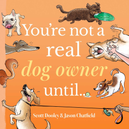

## Details
Note: For transparency - I received this book as an eARC from NetGalley. This will not impact my review. 

- Author: Scott Dooley; Jason Chatfield
- Publish Date: 2025-04-29

## Rating ⭐⭐⭐⭐
- Cover: ⭐⭐⭐
- Initial Draw: ⭐⭐⭐⭐
- Characters: n/a
- Plot and Pacing: n/a
- Last Page Feeling: n/a

## Review

This is a quick little book composed of standalone comics about common scenarios that dog owners find themselves in. 

I found most of the comics very relatable and humorous but I do agree with some of the other reviews that the mini stories in the middle didn't make much sense. 

There isn't much to say about this one but it would make a good coffee table gift for any dog owner. Check it out if you see it in your local book store!